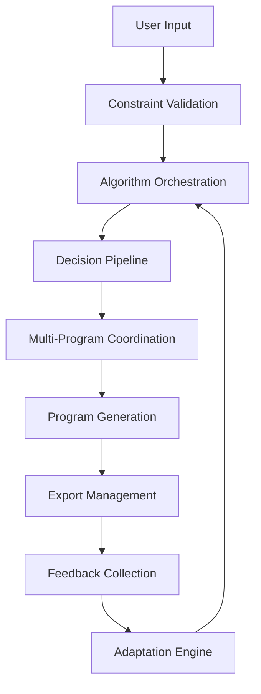

# 🏗️ Program Design Framework Architecture
## Multi-Program Management Pipeline Architecture

## 🎯 **ARCHITECTURAL DECISION: MULTI-PROGRAM MANAGEMENT**

Based on your sophisticated algorithm integration and comprehensive system analysis, we're implementing **Option B: Multi-Program Management** for maximum scalability and future-proofing.

---

## 🏛️ **PIPELINE ARCHITECTURE OVERVIEW**

```
                         PROGRAM DESIGN FRAMEWORK
                                    │
            ┌─────────────────────────┼─────────────────────────┐
            │                        │                         │
    🔤 INPUT LAYER           ⚙️ PROCESSING PIPELINE      📤 OUTPUT LAYER
            │                        │                         │
            │                        │                         │
    ┌───────┴───────┐        ┌───────┴───────┐         ┌───────┴───────┐
    │               │        │               │         │               │
  USER INPUTS    CONSTRAINTS ALGORITHM       PROGRAM    EXPORT      TRACKING
  COLLECTION     VALIDATION  ORCHESTRATION   GENERATION MANAGEMENT  INTEGRATION
```

---

## 🔤 **INPUT LAYER ARCHITECTURE**

### **1. User Requirements Collection**
```javascript
// Enhanced Input Interface
const ProgramInputInterface = {
    // Basic Requirements
    userProfile: {
        experience: 'beginner' | 'intermediate' | 'advanced',
        trainingAge: number,
        goals: ['strength', 'hypertrophy', 'powerlifting', 'performance'],
        preferences: {
            sessionDuration: number,
            trainingDays: number,
            splitPreference: string
        }
    },
    
    // Advanced Requirements
    constraints: {
        equipment: string[],
        injuries: InjuryProfile[],
        timeConstraints: TimeConstraints,
        periodization: PeriodizationPreferences
    },
    
    // Multi-Program Context
    programContext: {
        isNewProgram: boolean,
        existingPrograms: ProgramMetadata[],
        transitionType: 'new' | 'progression' | 'specialization',
        competitionSchedule?: CompetitionPlan[]
    }
}
```

### **2. Constraint Validation Engine**
```javascript
const ConstraintValidator = {
    // Physical Constraints
    validatePhysicalCapacity: (userProfile, requirements) => ValidationResult,
    validateEquipmentAvailability: (requested, available) => ValidationResult,
    validateTimeRequirements: (programDemands, availability) => ValidationResult,
    
    // Program Compatibility
    validateProgramProgression: (currentProgram, nextProgram) => ValidationResult,
    validateGoalAlignment: (shortTerm, longTerm) => ValidationResult,
    
    // Safety Validation
    validateVolumeProgression: (current, proposed) => SafetyCheck,
    validateIntensityJumps: (transition) => SafetyCheck
}
```

---

## ⚙️ **PROCESSING PIPELINE ARCHITECTURE**

### **Phase 1: Algorithm Orchestration Engine**
```javascript
const AlgorithmOrchestrator = {
    // Your Existing Algorithm Integration (Enhanced)
    volumeIntelligence: {
        engine: useVolumeAlgorithms(),
        capabilities: [
            'stimulus_scoring',
            'progression_planning', 
            'landmark_optimization'
        ]
    },
    
    fatigueIntelligence: {
        engine: useFatigueAlgorithms(),
        capabilities: [
            'recovery_analysis',
            'deload_prediction',
            'frequency_optimization'
        ]
    },
    
    exerciseIntelligence: {
        engine: useExerciseAlgorithms(),
        capabilities: [
            'exercise_selection',
            'order_optimization',
            'program_generation'
        ]
    },
    
    // Multi-Program Orchestration (NEW)
    programIntelligence: {
        engine: useProgramIntelligence(),
        capabilities: [
            'multi_program_coordination',
            'transition_planning',
            'periodization_management'
        ]
    }
}
```

### **Phase 2: Decision Tree Pipeline**
```javascript
const DecisionPipeline = {
    // Stage 1: Program Type Classification
    classifyProgramType: (inputs) => {
        return {
            primaryType: 'strength' | 'hypertrophy' | 'power' | 'hybrid',
            specialization: boolean,
            complexity: 'basic' | 'intermediate' | 'advanced',
            duration: 'short' | 'medium' | 'long'
        }
    },
    
    // Stage 2: Methodology Selection
    selectMethodology: (classification, userProfile) => {
        return {
            periodization: 'linear' | 'undulating' | 'block' | 'conjugate',
            progressionModel: string,
            volumeModel: string,
            intensityModel: string
        }
    },
    
    // Stage 3: Algorithm Coordination
    coordinateAlgorithms: (methodology, constraints) => {
        return {
            executionOrder: string[],
            dataFlow: DataFlowMap,
            optimizationTargets: OptimizationTarget[]
        }
    }
}
```

### **Phase 3: Multi-Program Coordination**
```javascript
const MultiProgramCoordinator = {
    // Program Relationship Management
    manageProgramRelationships: (programs) => {
        return {
            primaryProgram: ProgramMetadata,
            supportingPrograms: ProgramMetadata[],
            conflicts: ConflictResolution[],
            synergies: SynergyOpportunity[]
        }
    },
    
    // Transition Planning
    planTransitions: (currentState, targetState) => {
        return {
            transitionType: 'immediate' | 'gradual' | 'deload_bridge',
            bridgingPhase: BridgingPhase,
            riskAssessment: RiskAssessment,
            timeline: TransitionTimeline
        }
    },
    
    // Load Balancing
    balanceTrainingLoad: (activePrograms) => {
        return {
            totalLoad: LoadMetrics,
            distribution: LoadDistribution,
            adjustments: LoadAdjustment[]
        }
    }
}
```

---

## 📤 **OUTPUT LAYER ARCHITECTURE**

### **1. Program Generation Engine**
```javascript
const ProgramGenerator = {
    // Single Program Generation (Enhanced)
    generateSingleProgram: (algorithmOutputs, userInputs) => {
        return {
            metadata: ProgramMetadata,
            structure: ProgramStructure,
            phases: ProgramPhase[],
            workouts: Workout[],
            progressionRules: ProgressionRule[]
        }
    },
    
    // Multi-Program Suite Generation (NEW)
    generateProgramSuite: (coordinatedOutputs) => {
        return {
            primaryProgram: Program,
            supportingPrograms: Program[],
            coordinationRules: CoordinationRule[],
            transitionPlans: TransitionPlan[]
        }
    },
    
    // Adaptive Generation
    generateAdaptiveProgram: (baseProgram, adaptationTriggers) => {
        return {
            baseStructure: Program,
            adaptationRules: AdaptationRule[],
            monitoringPoints: MonitoringPoint[],
            autoAdjustments: AutoAdjustment[]
        }
    }
}
```

### **2. Export & Integration Management**
```javascript
const ExportManager = {
    // Multiple Format Support
    exportFormats: [
        'pdf_detailed',
        'pdf_summary', 
        'excel_tracking',
        'json_data',
        'api_integration'
    ],
    
    // Integration Endpoints
    integrations: {
        trackingApps: ['MyFitnessPal', 'Jefit', 'Strong'],
        wearables: ['Whoop', 'Garmin', 'Apple Watch'],
        platforms: ['TrainingPeaks', 'HRV4Training']
    }
}
```

---

## 🔄 **FEEDBACK LOOP ARCHITECTURE**

### **Real-Time Adaptation Engine**
```javascript
const AdaptationEngine = {
    // Performance Monitoring
    monitorPerformance: (actualResults, predictedResults) => {
        return {
            variance: VarianceAnalysis,
            accuracy: AccuracyMetrics,
            adjustmentNeeds: AdjustmentRecommendation[]
        }
    },
    
    // Automatic Adjustments
    triggerAutoAdjustments: (monitoringData) => {
        return {
            volumeAdjustments: VolumeAdjustment[],
            intensityAdjustments: IntensityAdjustment[],
            exerciseRotations: ExerciseRotation[],
            deloadTriggers: DeloadTrigger[]
        }
    },
    
    // Learning Integration
    updateAlgorithmModels: (feedbackData) => {
        return {
            modelUpdates: ModelUpdate[],
            confidenceScores: ConfidenceScore[],
            recommendationImprovements: RecommendationImprovement[]
        }
    }
}
```

---

## 🎯 **DATA FLOW MAPPING**

### **Pipeline Data Flow**


### **Algorithm Integration Points**
```javascript
const IntegrationPoints = {
    // Volume → Fatigue Integration
    volumeFatigueSync: (volumeData, fatigueData) => {
        return reconcileVolumeFatigueConflicts(volumeData, fatigueData)
    },
    
    // Exercise → Volume Integration  
    exerciseVolumeSync: (exerciseSelections, volumeTargets) => {
        return optimizeExerciseVolumeAlignment(exerciseSelections, volumeTargets)
    },
    
    // Intelligence → All Integration
    intelligenceOverlay: (allAlgorithmOutputs) => {
        return applyIntelligentOptimizations(allAlgorithmOutputs)
    }
}
```

---

## 🚀 **IMPLEMENTATION ROADMAP**

### **Phase 1: Foundation (Week 1)**
1. **Input Layer Implementation**
   - Enhanced user input collection
   - Constraint validation engine
   - Multi-program context handling

### **Phase 2: Pipeline Core (Week 2-3)**  
1. **Algorithm Orchestration Enhancement**
   - Multi-program coordination layer
   - Decision pipeline implementation
   - Algorithm integration optimization

### **Phase 3: Output & Adaptation (Week 4)**
1. **Output Layer Implementation**
   - Multi-program generation engine
   - Export management system
   - Feedback loop integration

---

## 📊 **SUCCESS METRICS**

### **Framework Performance Indicators**
- **Generation Speed**: < 3 seconds for complex multi-program suites
- **Accuracy**: > 85% user satisfaction with generated programs
- **Adaptability**: Real-time adjustments within 24 hours of feedback
- **Scalability**: Support for 5+ concurrent programs per user

### **Algorithm Integration Quality**
- **Consistency**: < 5% conflicts between algorithm recommendations
- **Optimization**: > 20% improvement in program effectiveness
- **Intelligence**: Predictive accuracy > 80% for adaptation needs

---

**Ready to proceed with the detailed implementation of this Multi-Program Management Pipeline Architecture?**

The framework leverages your existing sophisticated algorithm integration while adding the multi-program coordination layer that positions you for advanced features like competition peaking, specialization programs, and intelligent program transitions.

**Next Step**: Detailed implementation of the Input Layer with enhanced user requirements collection and constraint validation.
